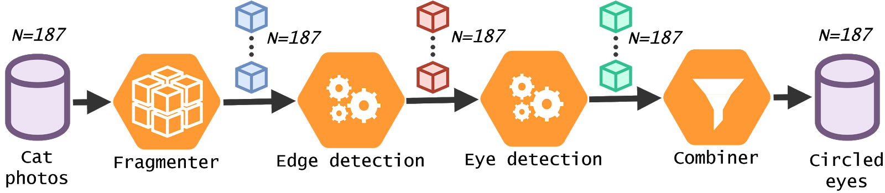

# Demo pipeline

This repository is a short tutorial/demo on how to create a simple pipeline using Iterum. For this demo, we will perform an experiment  where the eyes of cats will be detected using edge detection and a hough transform. Before starting, make sure the Iterum cluster is up and running, and the correct ports are opened. How the cluster can be set up can be found [here](https://github.com/iterum-provenance/cluster).


We start with a dataset consisting of 10 cat images. The pipeline then consists of the following steps:

1. Split the dataset into separate fragments
1. Perform edge detection on the images
1. Perform the hough transform for circles on the edges
1. Store the results




## 1. Creating a versioned dataset

To run this experiment using Iterum we first have to version the dataset. The images themselves are stored in the *images* subfolder of this repository.

#### 1.1. Initializing a dataset
First we have to create a folder for the dataset. Run
```
mkdir cats-dataset
cd cats-dataset/
```
Then you can run
```
iterum data init
```
Follow the instructions on what name, description and backend the dataset should have. For this tutorial, we use the following values:
```
    Name: cats-dataset
    Desciption: A nice subset of our cat images
    Backend: Local
```

#### 1.2. Creating *idv-config.yaml*
Then we have to edit the newly created `idv-config.yaml` file in the folder. 
```
touch idv-config.yaml
```
Edit this file such that it contains the following text:
```
name:
  cats-dataset
daemon:
  http://localhost:3000/
backend:
  Local
credentials:
  path:
    /localStorage/
```
Be sure to replace the name of the dataset (`cats-dataset`) corresponds with the name you picked in the previous step.

#### 1.3. Syncing with the daemon
You now have to sync the dataset with the daemon, such that the daemon is aware that this dataset exists. This can be done using the following command:
```
iterum data setup
```

#### 1.4. Adding and committing the cat photos
Now the cats can be added and committed to the dataset. Run the following command:
```
iterum data add -r ../cats_subset
```
To see the staged files
```
iterum data status
```
If you are satisfied with the files staged for commit, you can commit this version, and upload the files. For this, run:
```
iterum data commit "10-cats" "Added 10 cats"
```

#### 1.5. Retrieving the commit hash
You have now added a new version to the dataset. Before you can run the pipeline, you need to retrieve the correct commit hash. This can be done using the following command:
```
iterum ls -c
```
This results in the following output:
```
10-cats          <HASH_CATS>
root             <HASH_ROOT>
```
Take note of the `<HASH_CATS>`, which we will need for the pipeline deployment.


## 2. Build and push the images to a container registry available to your cluster
This step depends a bit on your specific Kubernetes implementation. If a local registry does not work for you, you can always use the public Dockerhub registry for this step. Be sure to replace `<YOUR-REGISTRY>` with the url of your actual registry. (There are also images for this demo present on the Iterum DockerHub. If you want to use these, replace `<YOUR-REGISTRY>` with `iterum`, and skip to step 3).

#### 2.1 Run the following commands to build the images:
```
docker build -t <YOUR-REGISTRY>/demo-fragmenter:v1.0 ./0_fragmenter
docker build -t <YOUR-REGISTRY>/demo-edge-detection:v1.0 ./1_edge_detection
docker build -t <YOUR-REGISTRY>/demo-hough-transform:v1.0 ./2_hough_transform
```
#### 2.2 Run the following commands to push the images to your registry:
```
docker push <YOUR-REGISTRY>/demo-fragmenter:v1.0
docker push <YOUR-REGISTRY>/demo-edge-detection:v1.0
docker push <YOUR-REGISTRY>/demo-hough-transform:v1.0 
```

## 3. Configure and deploy the pipeline

#### 3.1 Configuring a pipeline
The file `deployment.json` in the root of this repository shows an example deployment file for a pipeline. This file looks something like this:
```
{
  "name": "demo-pipeline",
  "input_dataset": "cats-dataset",
  "input_dataset_commit_hash": "<YOUR-COMMIT-HASH>",
  "fragmenter": {
    "image": "<YOUR-REGISTRY>/demo-fragmenter:demo-v1",
    "output_channel": "fragmenter_output"
  },
  "steps": [
    {
      "name": "edge-detection",
      "image": "<YOUR-REGISTRY>/demo-edge-detection:demo-v1",
      "input_channel": "fragmenter_output",
      "output_channel": "edge_detection_output",
      "config": {
        "BLUR_KERNEL_SIZE": 3,
        "H_THRESHOLD1": 320,
        "H_THRESHOLD2": 220
      }
    },
    {
      "name": "hough-transform",
      "image": "<YOUR-REGISTRY>/demo-hough-transform:demo-v1",
      "input_channel": "edge_detection_output",
      "output_channel": "hough_transform_output",
      "config": {
        "HIGH_THRESHOLD": 20,
        "LOW_THRESHOLD": 20
      }
    }
  ],
  "combiner": {
    "input_channel": "hough_transform_output"
  }
}
```
Copy this json structure to a file called `my_deployment.json`, and change the following values: `<YOUR-REGISTRY>` to your container registry URL, and `<YOUR-COMMIT-HASH>` to the commit hash you retrieved in step 1.5 of this tutorial.


#### 3.3 Deploying a pipeline
You can now deploy this pipeline by running 
```
iterum pipeline submit my_deployment.json
```
This should deploy the pipeline on your Iterum cluster. Note that the inital pull of the images can take some time.

#### 3.4 Examine the status of the pipeline
You can examine the status of the pipeline by running  
```
iterum pipeline status
```
to retrieve the pipeline hash, and then running
```
iterum pipeline status <PIPELINE_HASH>
```
to retrieve the status of the pipeline.

#### 3.5 Examine the results of the pipeline
After each step has finished running, you can retrieve results of the pipeline by running:  
```
iterum pipeline results
```
which results in a list of results. The individual results can then be downloaded using:
```
iterum pipeline download <PIPELINE_HASH> <FILE_NAME> .
```

You can download lineage information by running the following commands:

```
mkdir lineage
iterum pipeline lineage <PIPELINE_HASH> ./lineage 
```

## Conclusion
This concludes the demo tutorial